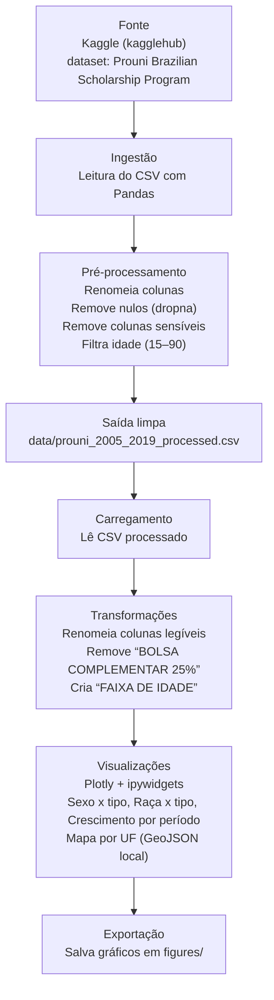

# Prouni Data Insights — Pipeline (Mermaid)

```mermaid
flowchart TB
  A["Fonte<br/>Kaggle (kagglehub)<br/>dataset: Prouni Brazilian Scholarship Program"] --> B["Ingestão<br/>Leitura do CSV com Pandas"]
  B --> C["Pré-processamento<br/>Renomeia colunas<br/>Remove nulos (dropna)<br/>Remove colunas sensíveis<br/>Filtra idade (15–90)"]
  C --> D["Saída limpa<br/>data/prouni_2005_2019_processed.csv"]
  D --> E["Carregamento<br/>Lê CSV processado"]
  E --> F["Transformações<br/>Renomeia colunas legíveis<br/>Remove “BOLSA COMPLEMENTAR 25%”<br/>Cria “FAIXA DE IDADE”"]
  F --> G["Visualizações<br/>Plotly + ipywidgets<br/>Sexo x tipo, Raça x tipo, Crescimento por período<br/>Mapa por UF (GeoJSON local)"]
  G --> H["Exportação<br/>Salva gráficos em figures/"]
```
